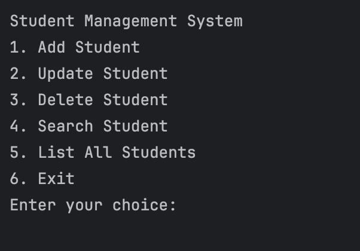

# Student Management System Project

  

## ℹ️ About The Project 
This project is about a simple student management system using Python. This system will allow users to add, update, delete, and search for student records. Each student record will include information such as name, age, grade, and subjects.

## ✅ Functions that the system provide: 
* Add a new student record. 
* Update an existing student record.
* Delete a student record based on the student's name.
* Search for a student by name and return their record.
* Print a list of all student records.

## ⁉️ How to use?
When the program initially starts, the student list is empty. Until the user selects the option to terminate the program, the system prompts them to choose from a series of options:
1. Add student ➕
2. Update Student 🆙
3. Delete Student ✖️
4. Search Student 🔍
5. List All Students 📋
6. Exit ❌

* If the user wishes to add a student, they select the "Add Student" option. After selecting this option, the system prompts them to enter the student's name, age, grade, and a series of disciplines in which the student participates. Upon successful addition of the student, the system notifies the user with a message that the student has been successfully added.

* If the user wishes to update any of the fields of an already existing student, they must select the "Update Student" option. The system then asks for each field containing information about the student what the user wants to update. If the user wishes for a field not to be changed, they simply press Enter without entering anything. All other fields that are filled in will be updated in the record for the specific student. After successfully updating the information, the system displays a message for successful update.

* If the user wishes to delete a record for a student, they must select the "Delete Student" option. After being prompted by the system to enter the name of the student they wish to delete from the system, upon finding the student, they are deleted. The user is notified if the student they are trying to delete does not exist in the system, or if the student was successfully deleted.

* If the user wishes to find information about a specific student, they must select the "Search Student" option. After entering the student's name, if the student is part of the system's records, information about the specific student is displayed on the screen.

* If the user wishes to print a list of all students and their information, they must select the "List All Students" option. The system then prints all available student records and information for each student.

* To exit the program, the user must select the "Exit" option.

## 🧑‍💻 User Menu:

  

## 🎥 Video Example Link:

* [▶️ Video Link ](https://github.com/todorpeychinov/Student_management_system/blob/main/video_example.mov)

(<a href="#readme-top">back to top</a>)

